# Library Management — Submission

Author: AVishikar
Date: 2026-05-03

---

**Project Overview**

This Spring Boot web application manages two entities: `Author` and `Book`.

Entities:
- `Author` — id (PK), name, nationality, email
- `Book` — id (PK), title, genre, publishedYear, price, author (FK → Author)

ER Design (textual):

Author (1) --- (N) Book

- One `Author` may have many `Book`s (one-to-many).
- Each `Book` references one `Author` via `author_id` (many-to-one).

---

**Database & Seeding**

- DB: H2 in-memory, URL `jdbc:h2:mem:librarydb` (see `src/main/resources/application.yaml`).
- Seeder: `src/main/java/com/library/library_management/config/DataSeeder.java` creates 10 authors and 10 books at application startup.

---

**Implementation Details (per operation)**

Note: below each operation I list the main files and a short code excerpt; relevant screenshots are embedded after each section.

1) Create — Authors
- Form view: `src/main/webapp/WEB-INF/views/authors/add.jsp`
- Controller: `src/main/java/com/library/library_management/controller/AuthorController.java`
- Service/Repo: `AuthorService`, `AuthorRepository`

Controller excerpt (add handler):

```
@PostMapping("/add")
public String addAuthor(@ModelAttribute Author author, RedirectAttributes redirectAttributes) {
    try {
        authorService.saveAuthor(author);
        redirectAttributes.addFlashAttribute("success", "Author added successfully!");
    } catch (DataIntegrityViolationException e) {
        redirectAttributes.addFlashAttribute("error", "Error: Duplicate or invalid data!");
    }
    return "redirect:/authors";
}
```

Screenshot:

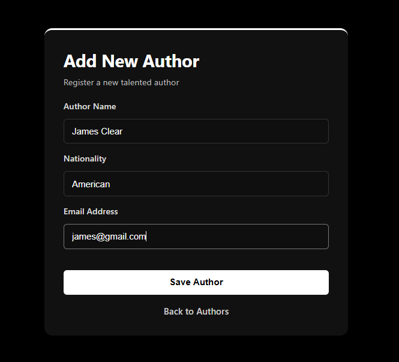

2) Read — Authors & Books (with join)
- Authors list view: `src/main/webapp/WEB-INF/views/authors/list.jsp`
- Books list view (uses join DTO): `src/main/webapp/WEB-INF/views/books/list.jsp`
- Repository custom join: `src/main/java/com/library/library_management/repository/BookRepository.java` returns `BookAuthorDTO`.

Repository excerpt (custom INNER JOIN):

```
@Query("SELECT new com.library.library_management.dto.BookAuthorDTO(" +
       "b.id, b.title, b.genre, b.publishedYear, b.price, a.name, a.nationality) " +
       "FROM Book b INNER JOIN b.author a")
List<BookAuthorDTO> findAllBooksWithAuthors();
```

Screenshots:

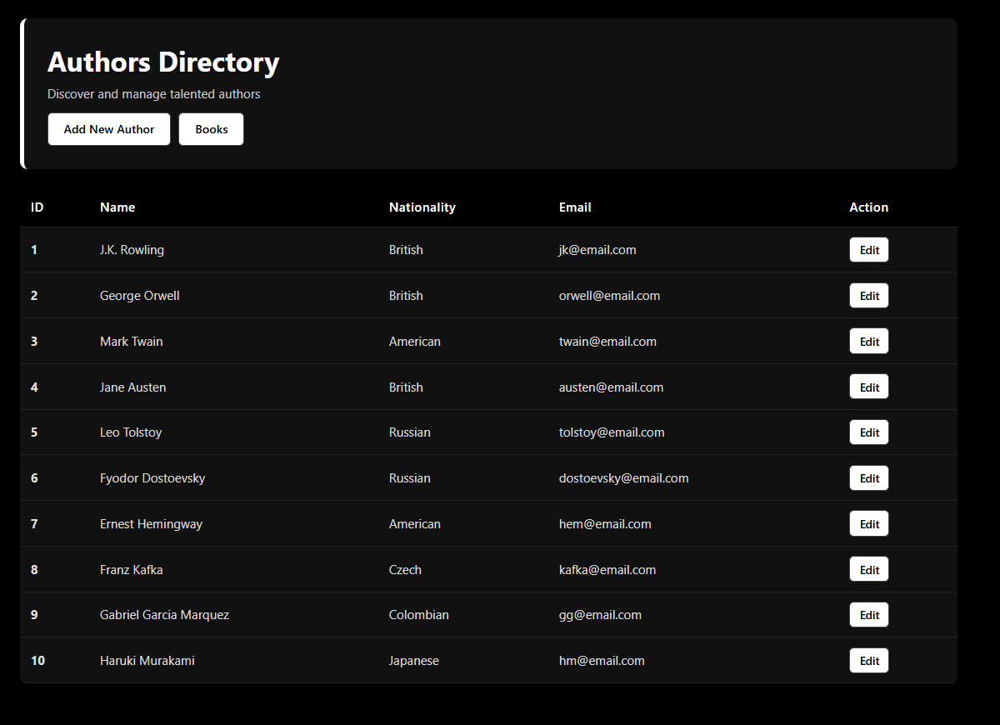

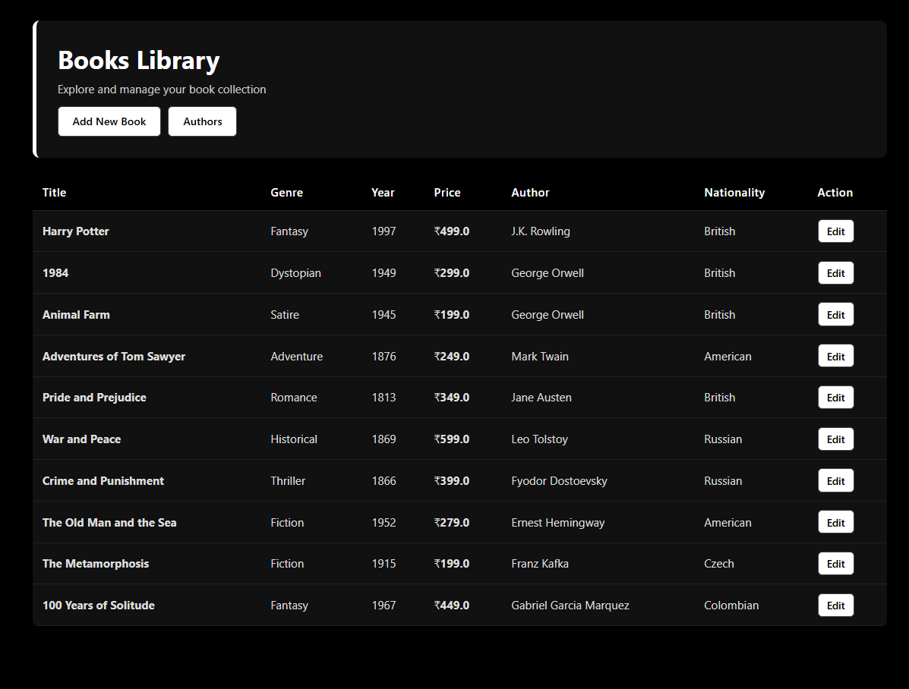

3) Update — Authors & Books
- Edit forms: `src/main/webapp/WEB-INF/views/authors/edit.jsp`, `src/main/webapp/WEB-INF/views/books/edit.jsp`
- Update handlers in controllers: `AuthorController.updateAuthor()` and `BookController.updateBook()`

Controller excerpt (book update):

```
@PostMapping("/update")
public String updateBook(@ModelAttribute Book book, @RequestParam Long authorId, RedirectAttributes redirectAttributes) {
    authorService.getAuthorById(authorId).ifPresent(book::setAuthor);
    bookService.updateBook(book);
    redirectAttributes.addFlashAttribute("success", "Book updated successfully!");
    return "redirect:/books";
}
```

Screenshots:

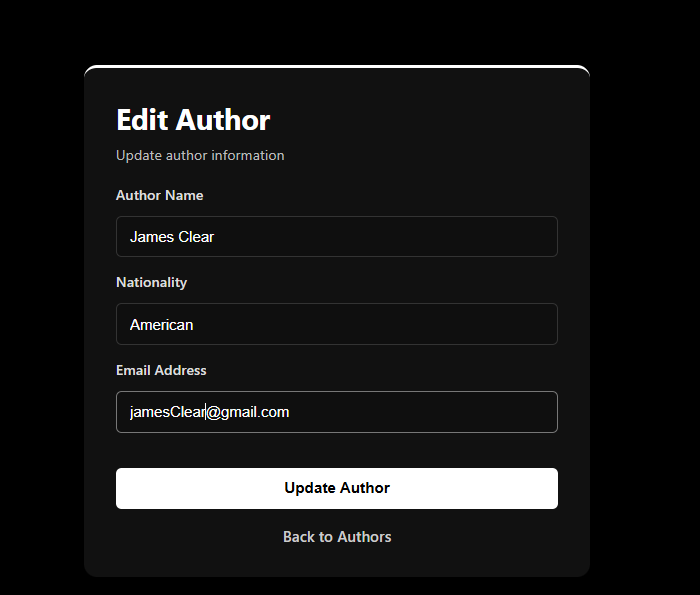

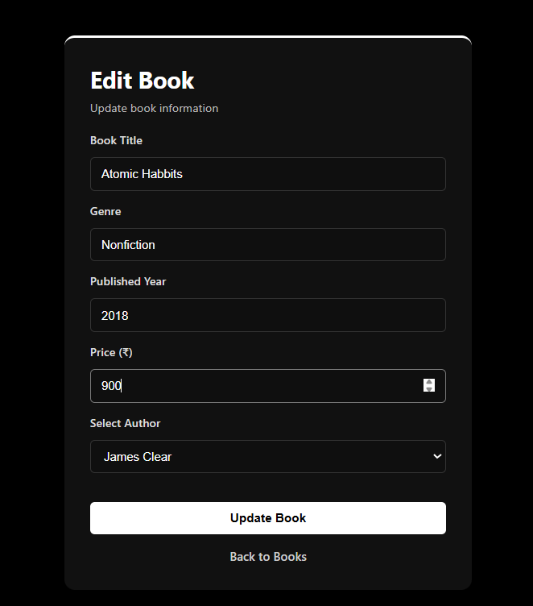

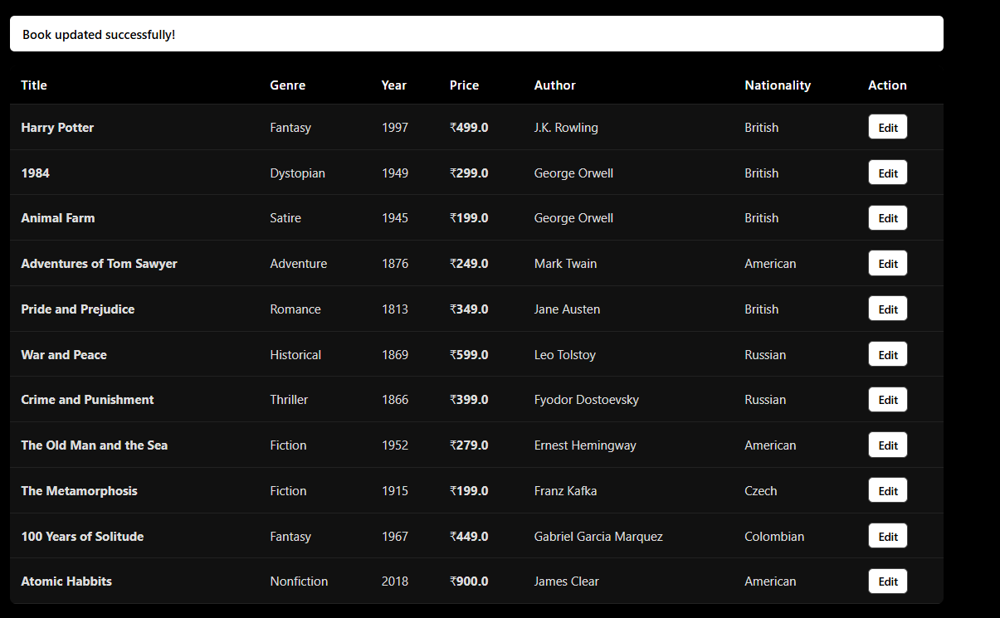

---

**How to run the application (local)**

From project root (`Library_Management`):

Windows (using wrapper):

```bash
mvnw.cmd spring-boot:run
```

If you have Maven installed:

```bash
mvn spring-boot:run
```

- Once running, open `http://localhost:8080/authors` to view Authors list.
- Open `http://localhost:8080/books` to view Books list.
- H2 Console: `http://localhost:8080/h2-console` (JDBC URL: `jdbc:h2:mem:librarydb`, user `sa`, no password).

Recommended quick checks to capture (see Screenshots checklist):
- Application startup console logs showing seeding (look for `DataSeeder` saves).
- H2 console result for `SELECT * FROM AUTHORS;` and `SELECT * FROM BOOKS;`.

---

**Additional Screenshots**

Add Book form:

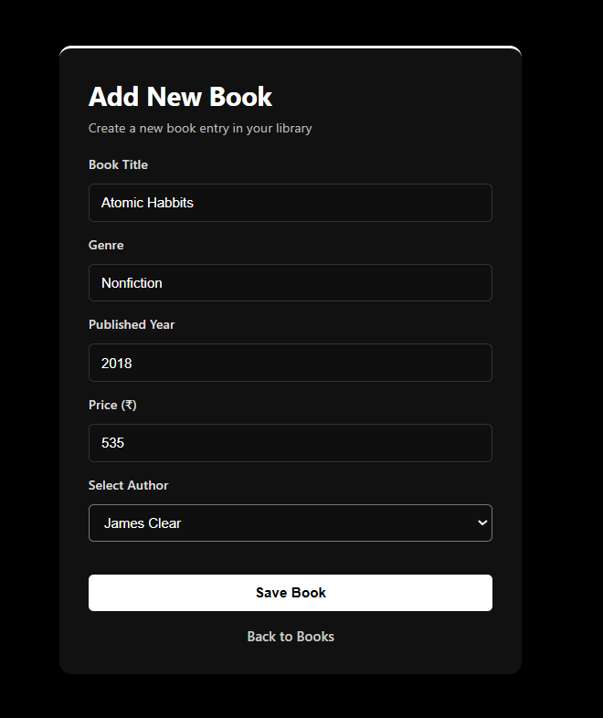

H2 console — AUTHORS:

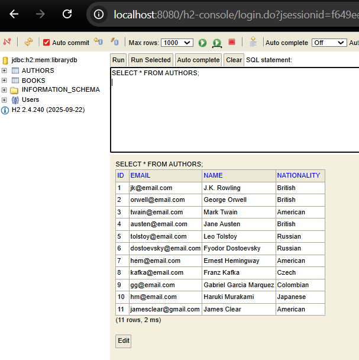

H2 console — BOOKS:

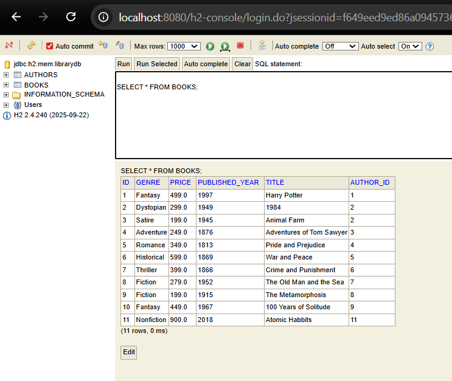

App seed logs:

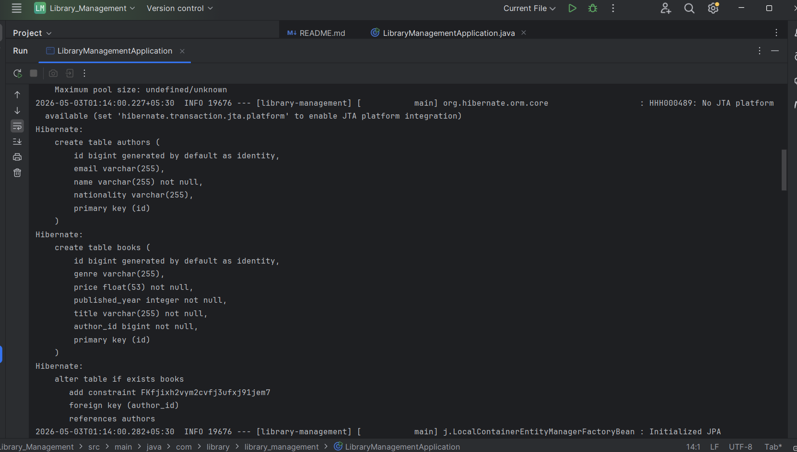

Test results:

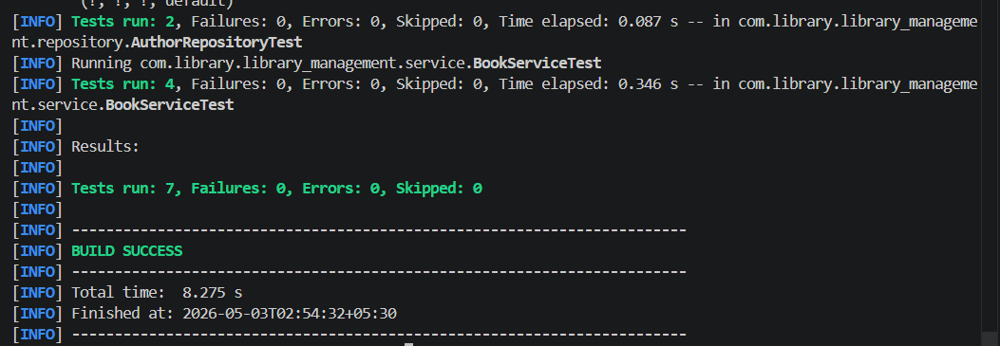

---

**Challenges faced & how I overcame them**

1. JSP + Spring Boot view prefix/suffix configuration — solved by setting `spring.mvc.view.prefix` and `suffix` in `application.yaml` and placing JSPs under `/WEB-INF/views/`.
2. Lazy loading of `Author.books` and rendering authors inside a books list — avoided N+1 by using a DTO `BookAuthorDTO` and an explicit `INNER JOIN` in `BookRepository`.
3. Ensuring seed data insertion runs only once — `DataSeeder` checks `authorRepository.count() > 0` before seeding.
4. H2 console access when running as WAR on embedded Tomcat — enabled `spring.h2.console.enabled=true` in `application.yaml`.

---

**Unit tests included**

- `src/test/java/com/library/library_management/repository/AuthorRepositoryTest.java`
- `src/test/java/com/library/library_management/service/BookServiceTest.java`

These test repository save/find and service behavior with Mockito.

To run tests:

```bash
mvnw.cmd test
```

---

**GitHub URL**

Please replace the placeholder below with your repository URL after you push the project:

GitHub: 

---